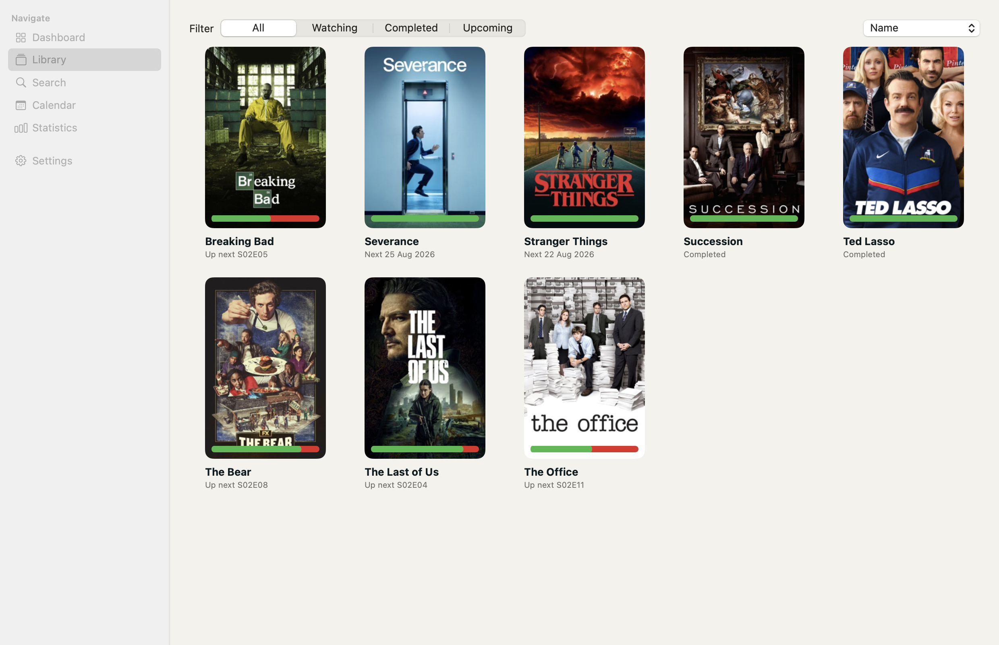

<p align="center">
  
</p>

<h1 align="center">showPirate</h1>

<p align="center"><em>Navigate your favorite shows.</em></p>

Native macOS TV tracker built with SwiftUI, SwiftData, and the [TMDB](https://www.themoviedb.org) API. Keep a library of series, mark episodes watched, and see what airs next.



## Features

- **Dashboard** — continue watching, upcoming episodes, recently aired
- **Library** — grid or list view with filters and sorting
- **Search** — find shows on TMDB and add them to your catalog
- **Calendar** — month view with episodes per day
- **Statistics** — watch time, progress, and favorite genres
- **Settings** — appearance, TMDB API key, catalog refresh, folder sync

## Requirements

- Mac with Apple Silicon or Intel
- macOS 14 Sonoma or later

## Download

Download the latest release from [GitHub Releases](https://github.com/starwash/showPirate/releases).

## First launch

The app starts with an **empty library**.

1. Open **Settings**
2. Paste your free TMDB **API Key (v3)**
3. Click **Save Key**
4. Go to **Search** and add your first shows

Get a key at [themoviedb.org/settings/api](https://www.themoviedb.org/settings/api).

No bundled TMDB credentials are shipped with the app.

## Sync between Macs

iCloud CloudKit is not used. In **Settings → Sync folder**, pick a shared folder (Dropbox, iCloud Drive, or Syncthing). The app stores `showPirate-library.json` there. Do the same on the other Mac. The TMDB API key is not synced.

## Build from source

Requirements: Xcode 16

```bash
git clone https://github.com/starwash/showPirate.git
cd showPirate
open ShowPirate.xcodeproj
```

Select the **showPirate** scheme and press Run.

## Architecture

SwiftUI + MVVM. Views render; view models and `LibraryStore` mutate data; `TMDBService` talks to the network with async/await. Persistence is SwiftData (`Show`, `Season`, `Episode`, `Genre`).

Sidebar: Dashboard, Library, Search, Calendar, Statistics, Settings.

## Attribution

This product uses the TMDB API but is not endorsed or certified by TMDB. Poster and still images are provided by TMDB.
